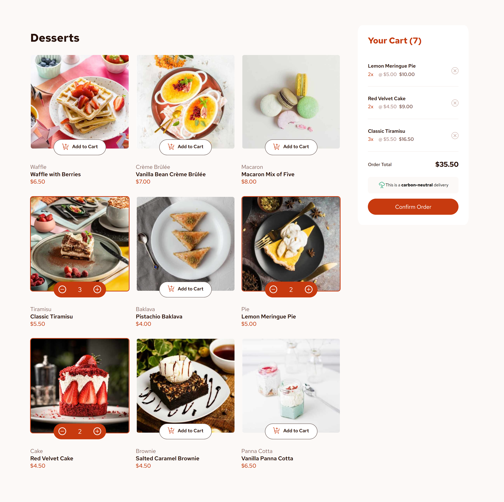

🛒 Frontend Mentor - Product list with cart solution

This is a solution to the Product list with cart challenge on Frontend Mentor
. Frontend Mentor challenges help you improve your coding skills by building realistic projects.

📑 Table of contents

🖼️ Screenshot

🔗 Links

🛠️ Built with

📚 What I learned

🚀 Continued development

👩‍💻 Author

Users should be able to:

➕ Add items to the cart and ❌ remove them

🔼🔽 Increase/decrease the number of items in the cart

✅ See an order confirmation modal when they click Confirm Order

🔄 Reset their selections when they click Start New Order

📱💻 View the optimal layout for the interface depending on their device's screen size

🖱️ See hover and focus states for all interactive elements on the page

🖼️ Screenshot

🔗 Links

🌐 Solution URL: [GitHub Repository](https://github.com/Fabiha517/Product-list-with-cart.git)

🚀 Live Site URL: [Live Demo](https://fabiha517.github.io/Product-list-with-cart/)

🛠️ Built with

🧾 Semantic HTML5 markup

🎨 CSS custom properties

📐 Flexbox

🗂️ CSS Grid

📱 Mobile-first workflow

✨ Vanilla JavaScript for interactivity (cart functionality, order modal, etc.)

📚 What I learned

While working on this project I practiced:

🛍️ Handling cart state using JavaScript objects

🔄 Dynamically updating the cart total and items in the DOM

📩 Managing a confirmation modal and resetting cart state

📏 Building a responsive layout using Grid and Flexbox without heavy use of positioning

Example of my cart state handling in JavaScript:

const cartState = {};

function updateCartTotal() {
const total = Object.values(cartState).reduce((sum, qty) => sum + qty, 0);
document.querySelector(".cart-quantity").innerHTML = `(${total})`;
}

🚀 Continued development

In future projects, I want to:

📦 Improve my state management for larger apps

🧩 Practice modular JavaScript (separating logic into smaller functions/files)

♿ Explore accessibility improvements (like keyboard navigation in the cart modal)

📎 Useful resources

📘 MDN Web Docs
– My go-to reference for HTML, CSS, and JavaScript.

📝 CSS Tricks
– Helped me refine responsive layouts and hover states.

👩‍💻 Author

Frontend Mentor – @Fabiha517

